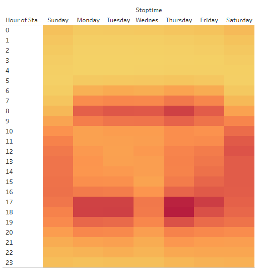

# Bike Sharing

## Overview

By analyzing Bike Sharing data from New York, the objective is to assess the feasibility of a similar
service in the Des Moines metropolitan area. During this the data will be analyzed to assess utilization
of bikes broken down by gender, hours, and location. 

## Results

Peak utilization demosntrates the bulk of usage is under ~30 minutes.

Rates of longer term usage (1+ hours) was similar between genders, but males utilize bikes at analyzedrate 
almost 4 times the usage of females. Targeted advertisement geared towards the untapped potential female 
customers could result in increased opportunities.

Usage data demonstrated optimal time for maintenance of bikes outside active usage windows, between 
midnight and 5am, ample time to conduct maintenance to keep bikes in service.

usage hours peak at similar times regardless of gender with potential growth for both being between 
10am and 4pm.

Subscriber usage indicates primary use is commuting whereas non-subscriber usage is recreational. Potential 
opportunities for additional targeted marketing and promotion.

Trip end points demonstrate density of rack locations necessary to service high throughput areas and provides 
insight on frequency necessary to service outlying areas.

Bike utilization shows the bulk of repairs should be focused on the ~20% of bikes that are utilized for most 
trips. Concentrating maintenance personnel in the high usage areas should keep bikes available for use, 
minimizing downtime and maximizing availability.

## Summary

## Resources

 - Data Source: 201908-citibike-tripdata.csv, modified_tripdata.csv
 - Software: Tableau Public (web), Python 3.7
